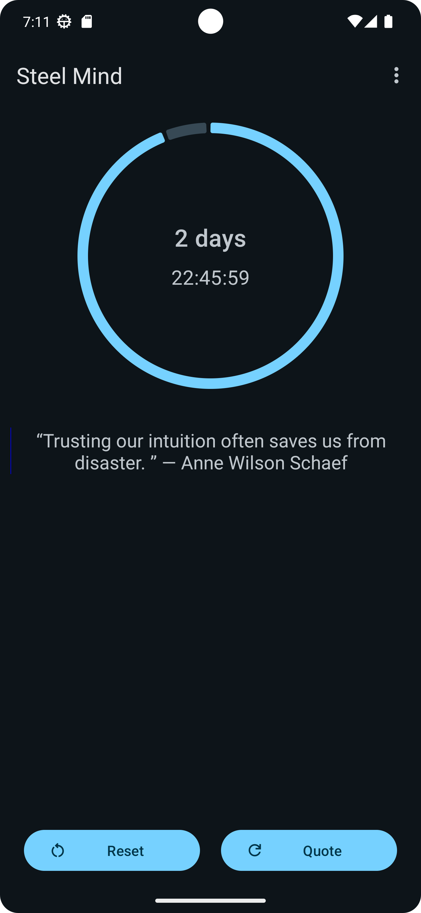
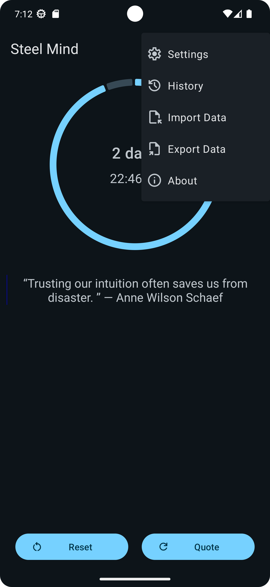
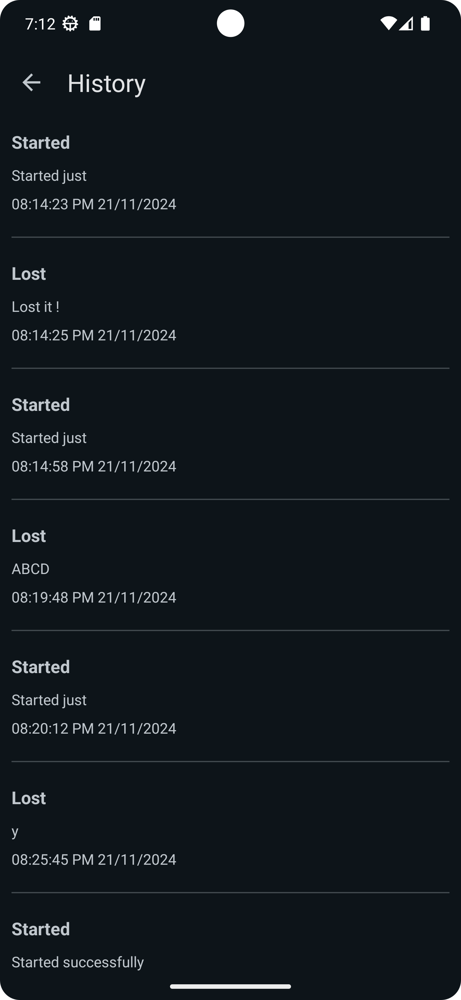

# Steel Mind


## Overview

**Steel Mind** is an empowering Android application designed to assist users in overcoming addictions and tracking personal progress. Built with the latest **Kotlin 1.9.10** and utilizing **Material Design 3**, it offers a modern and intuitive user experience. The app follows the **MVVM (Model-View-ViewModel)** architecture, ensuring a clean and maintainable codebase.

### Key Features

- **Progress Tracking:** Monitor your daily achievements with a dynamic circular progress indicator.
- **Streak Timer:** Keep motivated by viewing your ongoing streaks.
- **Start/Reset Functionality:** Easily initiate or reset your progress with a single tap.
- **Motivational Quotes:** Access a curated selection of motivational quotes to inspire your journey.
- **User-Friendly Interface:** Experience a sleek design adhering to Material Design 3 guidelines.

## Screenshots

<div style="display: flex; align-items: center; justify-content: center; gap: 10px;">
    
    
    
</div>


## Installation

1. **Clone the Repository:**
   ```bash
   git clone https://github.com/CodeWithTamim/SteelMind.git
   ```
2. **Open in Android Studio:**
    - Launch Android Studio.
    - Select 'Open an existing project' and navigate to the cloned directory.
3. **Build and Run:**
    - Connect your Android device or set up an emulator.
    - Click 'Run' to install and start the app.

## Usage

1. **Start Tracking:**
    - Open the app and tap the **Start** button to begin monitoring your progress.
2. **Monitor Progress:**
    - Use the circular progress indicator to view daily achievements.
    - The streak timer displays the duration of your ongoing streak.
3. **Motivational Support:**
    - Tap the **Motivational Quotes** button to receive daily inspiration.

## Architecture

Steel Mind is structured using the **MVVM** architecture, promoting:

- **Separation of Concerns:** Clear distinction between UI and business logic.
- **Testability:** Facilitates unit testing of components.
- **Scalability:** Simplifies the addition of new features.

## Built With

- **Kotlin 1.9.10:** Leveraging the latest features and improvements.
- **Material Design 3:** Providing a cohesive and modern UI/UX.
- **MVVM Architecture:** Ensuring a robust and maintainable code structure.

## Contributing

Contributions are welcome! To contribute:

1. **Fork the Repository:**
    - Click the 'Fork' button on the repository's GitHub page.
2. **Create a Feature Branch:**
   ```bash
   git checkout -b feature/YourFeatureName
   ```
3. **Commit Your Changes:**
   ```bash
   git commit -m 'Add YourFeatureName'
   ```
4. **Push to Your Branch:**
   ```bash
   git push origin feature/YourFeatureName
   ```
5. **Open a Pull Request:**
    - Navigate to the original repository and click 'New Pull Request'.

## License

This project is licensed under the Apache 2.0 License. See the [LICENSE](LICENSE) file for details.

## Acknowledgements

- **Motivational Quotes API:** Providing the inspirational content.
- **Material Design Guidelines:** Guiding the app's design aesthetics.

## Contact

For queries or feedback, please contact:
[Tamim Hossain](mailto:tamimh.dev@gmail.com)

---

**Made with ❤️ by Tamim Hossain**
